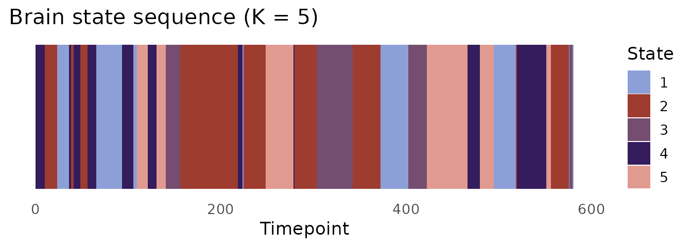
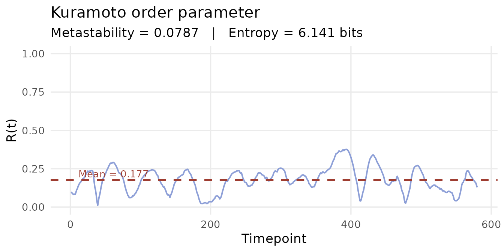

# Phase-based dynamic FC: Hilbert transform, LEiDA, and Kuramoto

## Overview

Phase-based dynFC methods characterise connectivity through the
**instantaneous phase** of the signal. Rather than asking how
*correlated* two regions are over a window, they ask: are two regions
**synchronised** at this exact moment — oscillating in phase, or in
anti-phase?

This perspective originates in the physics of coupled oscillators. Each
channel’s timeseries, once bandpass-filtered to a frequency band of
interest, behaves like a noisy oscillator. The Hilbert transform
extracts the instantaneous phase of that oscillation at every timepoint.
Two channels are phase-locked when their phases move together; they are
in anti-phase synchrony when their phases are consistently offset by π
radians.

Although this vignette uses BOLD fMRI data and refers to parcels and TR
throughout, the same methods apply to any band-limited
neurophysiological signal — including EEG narrow-band epochs, LFP, and
MEG.

`dynR` implements three phase-based methods:

| Function | Output | Method |
|----|----|----|
| [`hilbert_phases()`](https://dynr.circadia-lab.uk/reference/hilbert_phases.md) | Instantaneous phases 
``` math
N × Tmax
``` | Hilbert transform |
| [`dyn_phase_lock()`](https://dynr.circadia-lab.uk/reference/dyn_phase_lock.md) | Phase-locking matrices + LEiDA vectors | dPL / LEiDA |
| [`kuramoto()`](https://dynr.circadia-lab.uk/reference/kuramoto.md) | Synchrony, metastability, entropy | Kuramoto order parameter |

------------------------------------------------------------------------

## Step 1: Bandpass filtering

Phase extraction via the Hilbert transform assumes the signal is
approximately **monocomponent** — dominated by oscillations within a
single frequency band. Applying a bandpass filter before the transform
is therefore not merely conventional; it is necessary. Without it,
broadband noise and low-frequency drift corrupt the phase estimate,
producing meaningless phase differences between parcels.

For resting-state fMRI at TR = 2 s, the standard band is **0.01–0.1
Hz**, which preserves the slow fluctuations that drive functional
connectivity while attenuating scanner drift (\< 0.01 Hz) and
physiological noise (\> 0.1 Hz).

``` r

ts_filt <- apply(ts, 1, bandpass_filter,
                 flp = 0.01, fhi = 0.1, delt = 2, order = 2)
ts_filt <- t(ts_filt)   # restore [N × Tmax] orientation
dim(ts_filt)
#> [1] 200 600
```

The [`apply()`](https://rdrr.io/r/base/apply.html) call filters each
parcel (row) independently; [`t()`](https://rdrr.io/r/base/t.html)
restores the
``` math
N × Tmax
```
convention expected by downstream functions.

------------------------------------------------------------------------

## Step 2: Instantaneous phases via the Hilbert transform

[`hilbert_phases()`](https://dynr.circadia-lab.uk/reference/hilbert_phases.md)
constructs the **analytic signal** for each parcel — a complex-valued
representation whose argument gives the instantaneous phase angle at
every timepoint.

``` r

phases <- hilbert_phases(ts_filt)
dim(phases)    # [200 × 600]
#> [1] 200 600
range(phases)  # in [-pi, pi]
#> [1] -3.141541  3.141524
```

Each row is a parcel; each column is a timepoint. Values are in radians.

------------------------------------------------------------------------

## Step 3: Dynamic phase-locking matrix (dPL) and LEiDA

### The dPL matrix

At each timepoint *t*,
[`dyn_phase_lock()`](https://dynr.circadia-lab.uk/reference/dyn_phase_lock.md)
constructs an *N* × *N* **phase-locking matrix**:

``` math
\text{dPL}_{ij}(t) = \cos\!\bigl(\phi_i(t) - \phi_j(t)\bigr)
```

Entry (*i*, *j*) = 1 when parcels *i* and *j* are perfectly in phase; −1
when perfectly anti-phase. The matrix is symmetric and has ones on the
diagonal. Ten timepoints are trimmed from each end to avoid Hilbert
transform edge effects.

### The leading eigenvector (LEiDA)

The dominant structure in each dPL matrix is captured by its **leading
eigenvector** — the eigenvector corresponding to the largest eigenvalue.
This vector has one entry per parcel:

- Parcels with the **same sign** are synchronised with each other at
  that moment.
- Parcels with **opposite signs** are in anti-phase.
- The **magnitude** of each entry reflects how strongly that parcel
  participates in the dominant pattern.

By tracking how this vector evolves over time and clustering it, we
identify recurring whole-brain phase-locking patterns — **brain states**
— without ever specifying a window length. This is the LEiDA framework
(Cabral et al., 2017).

``` r

dpl <- dyn_phase_lock(phases)
dim(dpl$sync_conn)   # [200 × 200 × 580]
#> [1] 200 200 580
dim(dpl$leida)       # [580 × 200]
#> [1] 580 200
```

``` r

t1 <- dpl$sync_conn[, , 1]
cat("Symmetric:    ", isTRUE(all.equal(t1, t(t1))), "\n")
#> Symmetric:     TRUE
cat("Diagonal = 1: ", all(abs(diag(t1) - 1) < 1e-10), "\n")
#> Diagonal = 1:  TRUE
```

------------------------------------------------------------------------

## Step 4: Brain state discovery with K-means

LEiDA vectors are clustered across time to identify recurring
phase-locking patterns. K-means is the standard choice (Cabral et al.,
2017; Lord et al., 2019).

### Choosing K

There is no universal rule for K. Typical choices in resting-state
research range from 2–3 (coarse global organisation) to 5–10 (finer
network distinctions). The `nstart` argument is critical — K-means is
sensitive to initialisation, so running many random restarts and keeping
the best solution is essential.

``` r

set.seed(42)
K  <- 5
km <- kmeans(dpl$leida, centers = K, nstart = 100, iter.max = 500)
table(km$cluster)
#> 
#>   1   2   3   4   5 
#> 102 184  78 100 116
```

### State sequence

``` r

state_cols <- c("#8D9FD7", "#9E3C30", "#754D71", "#341C5D", "#E19A8F")

ggplot(data.frame(t     = seq_along(km$cluster),
                  state = factor(km$cluster)),
       aes(x = t, y = 1, fill = state)) +
  geom_tile(height = 1) +
  scale_fill_manual(values = state_cols, name = "State") +
  labs(x = "Timepoint", y = NULL,
       title = "Brain state sequence (K = 5)") +
  theme_minimal(base_size = 13) +
  theme(axis.text.y  = element_blank(),
        axis.ticks.y = element_blank(),
        panel.grid   = element_blank())
```



The state sequence (`km$cluster`) feeds directly into `stateR` for
fractional occupancy, dwell time, and Markov transition analysis.

------------------------------------------------------------------------

## Step 5: Kuramoto order parameter

### The measure

The **Kuramoto order parameter** *R*(*t*) measures the degree of global
phase synchrony across all parcels at each timepoint:

``` math
R(t) = \frac{1}{N} \left| \sum_{j=1}^{N} e^{i\phi_j(t)} \right|
```

*R* = 1 means all parcels are perfectly phase-locked. *R* = 0 means
phases are uniformly distributed — no coherent synchrony anywhere.

### Metastability

The standard deviation of *R*(*t*) over the full scan is the
**metastability index**: a measure of how much the global
synchronisation level fluctuates.

- **High metastability**: the brain moves fluidly between synchronised
  and desynchronised states — a flexible, exploratory dynamic
  repertoire.
- **Low metastability**: synchronisation is more rigid, with less
  spontaneous switching.

Metastability has been linked to cognitive flexibility (Deco et al.,
2017). Reductions have been observed in ageing (Cabral et al., 2014) and
certain psychiatric conditions. Psilocybin markedly increases
metastability, consistent with a pharmacologically expanded dynamic
repertoire (Lord et al., 2019).

``` r

kop <- kuramoto(phases, base = 2, n_bits = 8)

cat("Metastability:", round(kop$metastability, 4), "\n")
#> Metastability: 0.0787
cat("Entropy (bits):", round(kop$entropy, 4), "\n")
#> Entropy (bits): 6.1409
```

``` r

df_kop <- data.frame(t = seq_along(kop$synchrony), R = kop$synchrony)

ggplot(df_kop, aes(x = t, y = R)) +
  geom_line(colour = "#8D9FD7", linewidth = 0.7) +
  geom_hline(yintercept = mean(kop$synchrony),
             colour = "#9E3C30", linetype = "dashed", linewidth = 0.9) +
  annotate("text",
           x     = max(df_kop$t) * 0.02,
           y     = mean(kop$synchrony) + 0.04,
           label = paste0("Mean = ", round(mean(kop$synchrony), 3)),
           colour = "#9E3C30", size = 3.5, hjust = 0) +
  scale_y_continuous(limits = c(0, 1)) +
  labs(x = "Timepoint", y = "R(t)",
       title = "Kuramoto order parameter",
       subtitle = paste0("Metastability = ", round(kop$metastability, 4),
                         "   |   Entropy = ",
                         round(kop$entropy, 3), " bits")) +
  theme_minimal(base_size = 13) +
  theme(panel.grid.minor = element_blank())
```



------------------------------------------------------------------------

## References

Cabral, J. et al. (2017). Cognitive performance in healthy older adults
relates to spontaneous switching between states of functional
connectivity during rest. *Scientific Reports*, 7(1), 5135.
<https://doi.org/10.1038/s41598-017-05425-7>

Deco, G. et al. (2017). The dynamics of resting fluctuations in the
brain: metastability and its dynamical cortical core. *Scientific
Reports*, 7(1), 3095. <https://doi.org/10.1038/s41598-017-03073-5>

Lord, L.-D. et al. (2019). Dynamical exploration of the repertoire of
brain networks at rest is modulated by psilocybin. *NeuroImage*, 199,
127–142. <https://doi.org/10.1016/j.neuroimage.2019.05.060>
