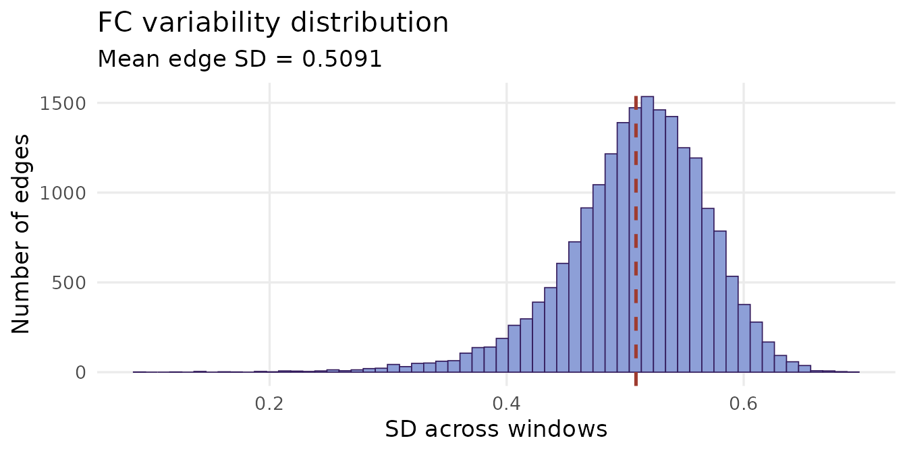
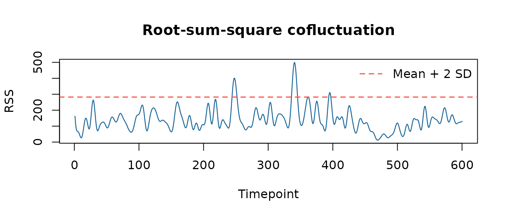
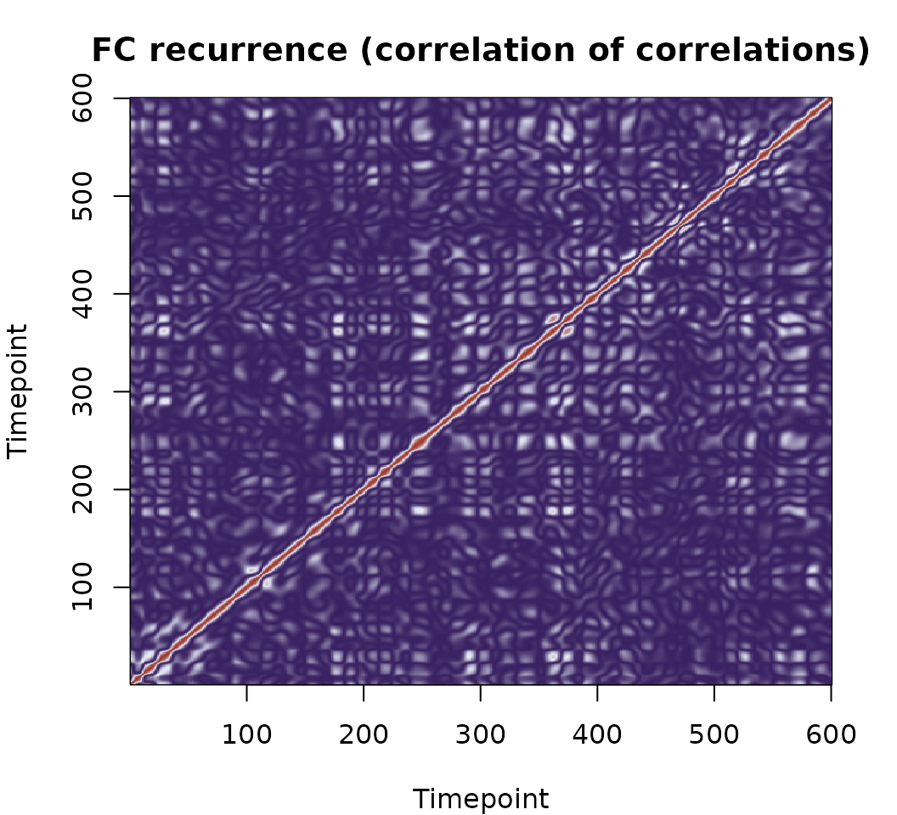
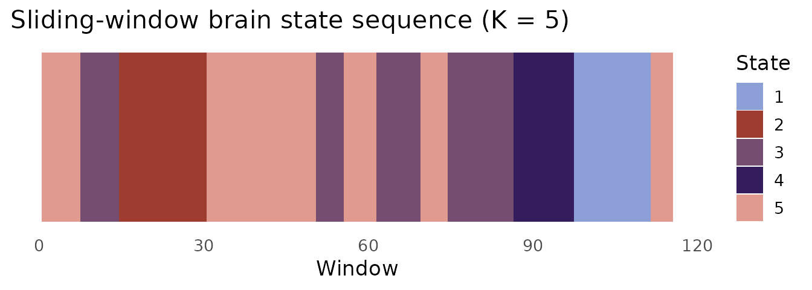

# Correlation-based dynamic FC: sliding windows and edge cofluctuations

## Overview

Correlation-based dynFC methods characterise how functional connectivity
evolves over time by either **windowing** the timeseries into short
segments and computing Pearson correlations within each window, or by
analysing the **instantaneous co-activation** of parcel pairs as a
continuous edge time series — no windowing required.

`dynR` implements three correlation-based functions:

| Function | Output | Method |
|----|----|----|
| [`corr_slide()`](https://dynr.circadia-lab.uk/reference/corr_slide.md) | FC matrices 
``` math
N × N × windows
``` | Sliding-window Pearson correlation |
| [`cofluct()`](https://dynr.circadia-lab.uk/reference/cofluct.md) | Edge time series 
``` math
n\_edges × Tmax
```
 + RSS | Edge-centric cofluctuation |
| [`corr_corr()`](https://dynr.circadia-lab.uk/reference/corr_corr.md) | FC recurrence matrix 
``` math
Tmax × Tmax
``` | Hansen et al. (2015) |

Although this vignette uses BOLD fMRI data throughout, these methods
apply to any multivariate timeseries where pairwise correlations carry
meaningful information, including EEG and LFP.

------------------------------------------------------------------------

## Sliding-window correlation

### Window length: a critical choice

Unlike phase-based methods, sliding-window FC requires you to commit to
a window length. The trade-off is fundamental:

- **Short windows** (\< 30 TRs): high temporal resolution, but FC
  estimates are noisy — reliable Pearson correlations require sufficient
  timepoints relative to the number of parcels.
- **Long windows** (\> 60 TRs): stable, low-noise FC estimates, but
  rapid state transitions are averaged away.
- **Typical choice**: **30–60 TRs** (60–120 s for TR = 2 s), with step
  size of 1 TR for fine temporal resolution or larger steps for
  efficiency (Hutchison et al., 2013; Leonardi & Van De Ville, 2015).

For this dataset (TR = 2 s, 600 timepoints), a few window choices look
like:

``` r

TRs <- c(20, 30, 45, 60)
data.frame(
  `Window (TRs)` = TRs,
  `Duration (s)` = TRs * 2,
  `N windows (step = 5)` = floor((600 - TRs) / 5) + 1L,
  check.names = FALSE
)
#>   Window (TRs) Duration (s) N windows (step = 5)
#> 1           20           40                  117
#> 2           30           60                  115
#> 3           45           90                  112
#> 4           60          120                  109
```

``` r

sw <- corr_slide(ts, window = 30, step = 5)
cat("Window:    30 TRs (60 s at TR = 2 s)\n")
#> Window:    30 TRs (60 s at TR = 2 s)
cat("Step:       5 TRs (10 s)\n")
#> Step:       5 TRs (10 s)
cat("N windows:", dim(sw$corr_mats)[3], "\n")
#> N windows: 115
```

### Validating against static FC

A single window spanning the full timeseries must recover the static FC
matrix exactly.

``` r

full     <- corr_slide(ts, window = ncol(ts))
max_diff <- max(abs(full$corr_mats[, , 1] - fc))
cat("Max deviation from static FC:", formatC(max_diff, format = "e"), "\n")
#> Max deviation from static FC: 8.8818e-16
```

### FC variability across windows

The standard deviation of each edge across windows — its *FC
variability* — reveals which connections drive the dynamic signal. Edges
with high variability are the ones that genuinely fluctuate; edges with
near-zero variability are essentially static.

``` r

n_parcels      <- dim(sw$corr_mats)[1]
ut             <- which(upper.tri(diag(n_parcels)), arr.ind = TRUE)
edge_by_window <- apply(sw$corr_mats, 3, function(m) m[ut])
edge_sd        <- apply(edge_by_window, 1, sd)

ggplot(data.frame(sd = edge_sd), aes(x = sd)) +
  geom_histogram(bins = 60, fill = "#8D9FD7", colour = "#341C5D",
                 linewidth = 0.3) +
  geom_vline(xintercept = mean(edge_sd),
             colour = "#9E3C30", linetype = "dashed", linewidth = 0.9) +
  labs(x = "SD across windows", y = "Number of edges",
       title = "FC variability distribution",
       subtitle = paste0("Mean edge SD = ", round(mean(edge_sd), 4))) +
  theme_minimal(base_size = 13) +
  theme(panel.grid.minor = element_blank())
```



------------------------------------------------------------------------

## Edge-centric cofluctuations

The edge-centric framework (Esfahlani et al., 2020; Faskowitz et al.,
2020) abandons the window entirely. Instead, each parcel’s timeseries is
z-standardised and the element-wise product of every unique parcel pair
is computed at every timepoint:

``` math
\text{ets}_{ij}(t) = z_i(t) \cdot z_j(t)
```

The result is an **edge time series** — a continuous, frame-by-frame
estimate of co-activation for every pair.

``` r

ec      <- cofluct(ts)
n_edges <- nrow(ec$edge_ts)
cat("Edges (N*(N-1)/2):", n_edges, "\n")
#> Edges (N*(N-1)/2): 19900
cat("Timepoints:       ", ncol(ec$edge_ts), "\n")
#> Timepoints:        600
```

### Root-sum-square (RSS) cofluctuation

The RSS vector summarises the total co-activation amplitude across all
edges at each timepoint:

``` math
\text{RSS}(t) = \sqrt{\sum_{(i,j)} \text{ets}_{ij}(t)^2}
```

High-RSS frames are moments of unusually strong, synchronised
co-activation across the whole brain. These **high-amplitude events**
have been shown to disproportionately drive the structure of the static
FC matrix — a small fraction of timepoints accounts for most of the
long-run average connectivity (Esfahlani et al., 2020).

``` r

thr    <- mean(ec$rss) + 2 * sd(ec$rss)
df_rss <- data.frame(t = seq_along(ec$rss), rss = ec$rss,
                     high = ec$rss > thr)

ggplot(df_rss, aes(x = t, y = rss)) +
  geom_line(colour = "#8D9FD7", linewidth = 0.6) +
  geom_hline(yintercept = thr,
             colour = "#9E3C30", linetype = "dashed", linewidth = 0.9) +
  annotate("text",
           x = max(df_rss$t) * 0.02, y = thr + 0.8,
           label = paste0("Mean + 2 SD  (n = ",
                          sum(df_rss$high), " frames)"),
           colour = "#9E3C30", size = 3.5, hjust = 0) +
  labs(x = "Timepoint", y = "RSS",
       title = "Root-sum-square cofluctuation",
       subtitle = paste0(round(mean(df_rss$high) * 100, 1),
                         "% of timepoints exceed threshold")) +
  theme_minimal(base_size = 13) +
  theme(panel.grid.minor = element_blank())
```



------------------------------------------------------------------------

## Correlation of correlations

[`corr_corr()`](https://dynr.circadia-lab.uk/reference/corr_corr.md)
computes a
``` math
Tmax × Tmax
```
matrix of pairwise correlations between edge time series. Entry (*t*1,
*t*2) answers: **how similar was the brain’s whole-network co-activation
pattern at timepoint *t*1 to that at *t*2?**

This makes it a **temporal recurrence matrix** — a fingerprint of how
often the brain revisits similar FC configurations. Key features to look
for:

- **Bright off-diagonal blocks**: the brain revisiting similar
  co-activation states at different times.
- **Diagonal block structure**: sustained states that persist over
  consecutive timepoints.
- **Sparse, diffuse structure**: rapidly shifting, non-recurrent
  dynamics.

``` r

cc <- corr_corr(ts)
cat("Dimensions:", nrow(cc), "×", ncol(cc), "\n")
#> Dimensions: 600 × 600
```

``` r

pal <- colorRampPalette(c("#341C5D", "#E8ECF8", "#9E3C30"))(256)
par(mar = c(4, 4, 3, 2))
image(seq_len(nrow(cc)), seq_len(ncol(cc)), cc,
      col  = pal,
      xlab = "Timepoint", ylab = "Timepoint",
      main = "FC recurrence (correlation of correlations)")
```



Warm colours indicate timepoints where the brain was in similar
connectivity configurations; cool colours indicate dissimilar states.
Visible block structure along the diagonal suggests sustained, recurring
FC patterns.

------------------------------------------------------------------------

## Brain state analysis from sliding-window FC

The upper triangle of each window’s FC matrix can be vectorised and
clustered with K-means to identify recurring connectivity states.

``` r

features <- t(apply(sw$corr_mats, 3, function(m) m[ut]))

set.seed(42)
K  <- 5
km <- kmeans(features, centers = K, nstart = 100, iter.max = 500)
```

Note on dimensionality: each feature vector has *N(N−1)/2* entries —
19,900 for 200 parcels. This high dimensionality makes K-means
convergence slower and noisier than in the LEiDA case, where each
feature vector has only *N* entries. For smaller datasets or
single-subject analyses, the LEiDA approach (see
[`vignette("phase-based-fc")`](https://dynr.circadia-lab.uk/articles/phase-based-fc.md))
is often preferable.

``` r

state_cols <- c("#8D9FD7", "#9E3C30", "#754D71", "#341C5D", "#E19A8F")

ggplot(data.frame(t     = seq_along(km$cluster),
                  state = factor(km$cluster)),
       aes(x = t, y = 1, fill = state)) +
  geom_tile(height = 1) +
  scale_fill_manual(values = state_cols, name = "State") +
  labs(x = "Window", y = NULL,
       title = "Sliding-window brain state sequence (K = 5)") +
  theme_minimal(base_size = 13) +
  theme(axis.text.y  = element_blank(),
        axis.ticks.y = element_blank(),
        panel.grid   = element_blank())
```



The state sequence feeds directly into `stateR` for fractional
occupancy, dwell time, and Markov transition analysis.

------------------------------------------------------------------------

## References

Hutchison, R. M. et al. (2013). Dynamic functional connectivity:
Promise, issues, and interpretations. *NeuroImage*, 80, 360–378.
<https://doi.org/10.1016/j.neuroimage.2013.05.079>

Leonardi, N. & Van De Ville, D. (2015). On spurious and real
fluctuations of dynamic functional connectivity during rest.
*NeuroImage*, 104, 430–436.
<https://doi.org/10.1016/j.neuroimage.2014.09.007>

Hansen, E. C. A. et al. (2015). Functional connectivity dynamics:
Modeling the switching behavior of the resting state. *NeuroImage*, 105,
525–535. <https://doi.org/10.1016/j.neuroimage.2014.11.001>

Esfahlani, F. Z. et al. (2020). High-amplitude cofluctuations in
cortical activity drive functional connectivity. *PNAS*, 117(45),
28393–28401. <https://doi.org/10.1073/pnas.2005531117>

Faskowitz, J. et al. (2020). Edge-centric functional network
representations of human cerebral cortex reveal overlapping system-level
architecture. *Nature Neuroscience*, 23(12), 1644–1654.
<https://doi.org/10.1038/s41593-020-00719-y>
